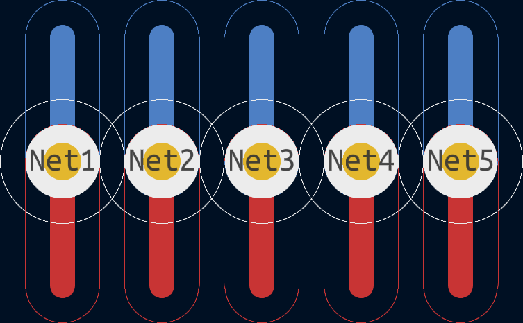
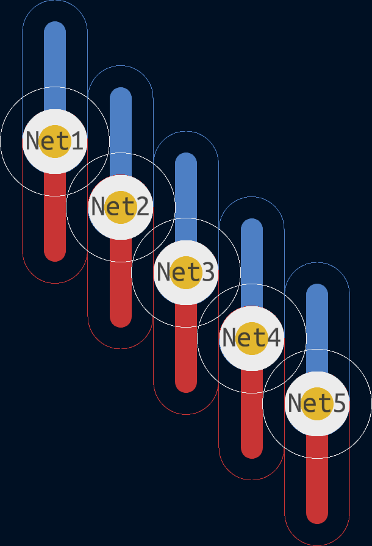
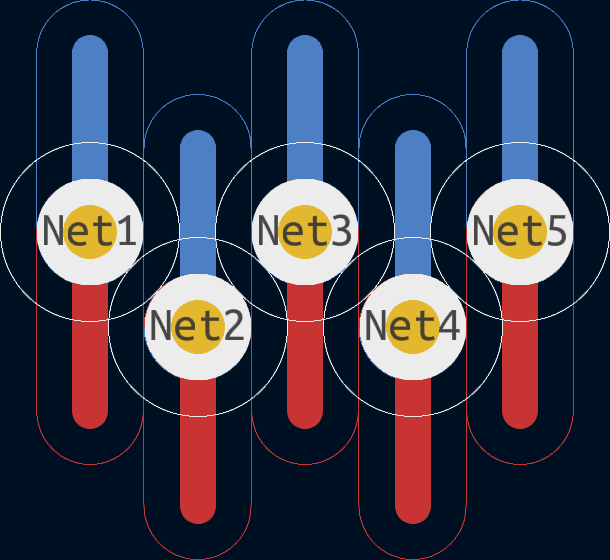
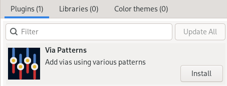
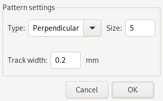
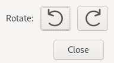

#  KiCad Via Patterns

|         |                                                                                                                                                                                                                                                                                                                                                                                                                                                                                                                                                                                                                    |
| ---     | ---                                                                                                                                                                                                                                                                                                                                                                                                                                                                                                                                                                                                                |
| CI/CD   |  
| Package |                                                                                                                                                                                        |
| Meta    |      |

-----

Add vias using various patterns

## Key Features

Arranges vias in pattern with respect to clearance rules and trace width.
Following table shows images of supported patterns with clearance outlines enabled.

<table>
  <tr>
    <td align="center"><b>Pattern</b></td>
    <th align="center"><b>Example</b></th>
  </tr>
  <tr>
    <td align="center" style="vertical-align: middle;">Perpendicular</td>
    <td align="center"></td>
  </tr>
  <tr>
    <td align="center" style="vertical-align: middle;">Diagonal</td>
    <td align="center"></td>
  </tr>
  <tr>
    <td align="center" style="vertical-align: middle;">Stagger</td>
    <td align="center"></td>
  </tr>
</table>

## Installation

To install release version of this plugin, use KiCad's `Plugin and Content Manager`
and select `Via Patterns` from official plugin repository.

Latest `master` build is automatically uploaded to unofficial PCM compatible
[repository](https://adamws.github.io/kicad-via-patterns/) hosted on GitHub pages.
To use it, add `https://adamws.github.io/kicad-via-patterns/repository.json`
to PCM repository list.

## How to use

1. Select via.
2. Click plugin icon to open dialog window.

    

   Select pattern type and size. Set track width. Click OK.
3. Adjust pattern orientation with rotation buttons in new pop-up dialog.

    

4. Pattern will start at position of selected via and will use it as an template (i.e. added vias will have same properties except net).
    - Pattern elements will be automatically selected to ease reposition or rotation/flip.
5. Update nets of created vias and continue routing.

## License

This project is distributed under the terms of the [MIT](https://spdx.org/licenses/MIT.html) license.
